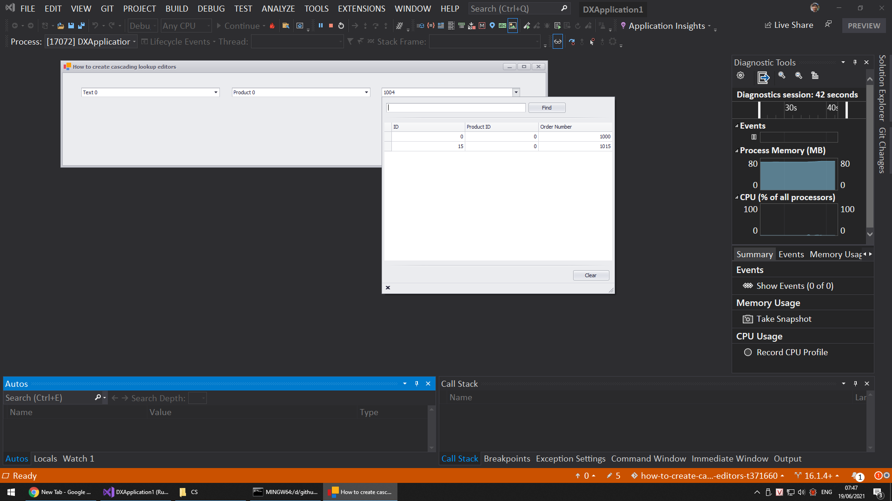

<!-- default file list -->
*Files to look at*:

* [DataProvider.cs](./CS/DXApplication1/DataProvider.cs) (VB: [DataProvider.vb](./VB/DXApplication1/DataProvider.vb))
* **[Main.cs](./CS/DXApplication1/Main.cs) (VB: [Main.vb](./VB/DXApplication1/Main.vb))**
<!-- default file list end -->
# How to create cascading lookup editors 

This example illustrates how to filter drop-down items of one lookup editor based on a value in another lookup editor. It is possible to implement this functionality with a single code line. For this, we set the <strong>LookUpEditBase.CascadingOwner</strong> property of a child lookup control to a parent lookup control. Once you set this property, our inner mechanism will try to guess what cascading member is. That is, what child data field corresponds to a parent data field. The child drop-down list should be filtered against this found field. If the automatic algorithm does not recognize any related fields, you can specify such a field (or even fields) manually by using the<strong> RepositoryItemLookUpEditBase.CascadingMember</strong> property.   Note that this feature is in effect in <strong>Standalone Mode</strong> and it is applicable to <strong>LookUpEdit</strong>, <strong>GridLookUpEdit</strong>, and <strong>SearchLookUpEdit</strong>.  Review the <a href="https://documentation.devexpress.com/#WindowsForms/CustomDocument116018">Cascading Lookups</a> help article for more information in this regard. 

 

